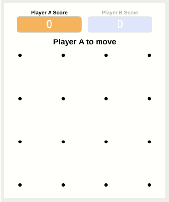

# dots-and-boxes

[Play Game](https://rogerhyang.github.io/dots-and-boxes/) ([Wikipedia](https://en.m.wikipedia.org/wiki/Dots_and_Boxes))

Two players take turns adding a line between two adjacent dots. The player finishing the 4th side of a box gets one point and takes another turn. The winner is the player with the most points when no more lines can be added. 



## Technology

Dots and boxes is built using vanilla JavaScript, HTML, and CSS.

### Making moves in game

Players can be both human or AI. When the current player is the computer, the computer player chooses a side and returns it to the game through an async function. For the human player, the game detects the user's mouse movements and clicks and deide which move the human player is making

```
async makeMove() {
  const currentPlayer = this.players[this.currentPlayerId];
  if (this.isOver() || !currentPlayer.isComputer) {
    return;
  } else {
    const side = await currentPlayer.makeMove();
    this.acceptMove(side);
  }
}
```

Accepting a move would flag the side of a box a taken, determine whether any box is now completed. If any boxes are completed, the current player receives points and can take a another turn. If no points are awarded, the turn is switched to the other player. At the same time, the game tracks the moves taken in a stack data structure.

```
 acceptMove(side) {
  side.taken = true;
  let points = 0;
  for (const box of side.boxes) {
    if (box.owner === undefined && box.isCompleted()) {
      box.owner = this.players[this.currentPlayerId];
      points += 1;
      this.unclaimedBoxCount -= 1;
    }
  }
  this.moves.push({ playerId: this.currentPlayerId, side, points });
  this.redos.length = 0;
  this.players[this.currentPlayerId].score += points;
  if (points === 0) {
    // switch player
    this.currentPlayerId = 1 - this.currentPlayerId;
  }
  this.makeMove();
}
```

The game detects mouse movement and delegates the response to the board object.

```
handleMouseMove(e) {
  if (!this.isOver() && !this.players[this.currentPlayerId].isComputer) {
    document.body.style.cursor = "default";
    const { offsetX, offsetY } = e;
    for (const side of this.board.sides) {
      side.highlighted = false;
    }
    if (this.board.containsMousePointer(offsetX, offsetY)) {
      this.board.handleMouseMove(offsetX, offsetY);
    }
  }
}
```
